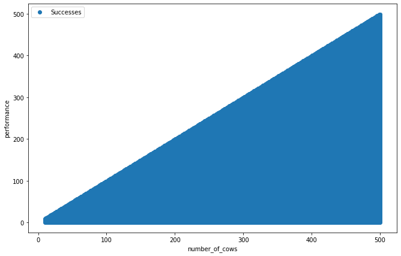
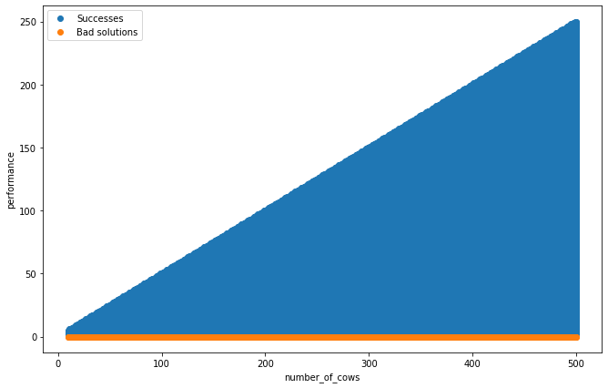

1. dragon finding challenge
---------------------------

    we need to find a dragon in the kingdom that is eating the cows. the
    dragon starts with the largest cow and works its way towards the
    smaller ones. we have a list of cows by their size due to the annual
    cow weighing championships, we can use that to find the cow where
    the dragon is expected next.

a solution is a function where

parameters:

-  is\_dead: function
-  it takes an integer parameter of the cows rank in the weight contest
   and returns a boolean value of whether a cow is dead or not
-  number\_of\_cows: int
-  the number of cows in the kingdom

returns:

-  an integer, the rank of the largest (the one with the smallest rank)
   cow that is alive

and it checks the least amount of cows possible

.. code:: ipython3

    from jkg_evaluators import dragonfind_10_to_500

.. code:: ipython3

    def my_solution1(is_dead,
                     number_of_cows):
        
        for i in range(1, number_of_cows):
            if not is_dead(i):
                return i

.. code:: ipython3

    dragonfind_10_to_500.evaluate(my_solution1)

.. parsed-literal::

    - success rate: 124714/124714 (100.0%)
    - error count: 0
    - best performance: 1
    - worst performance: 499
    - mean performance: 167.04724409448818

.. code:: ipython3

    dragonfind_10_to_500.visualize(my_solution1)

.. code:: ipython3

    def my_solution2(is_dead,
                     number_of_cows):
        
        middle_cow = int(number_of_cows / 2)
        
        if is_dead(middle_cow):
            
            for i in range(middle_cow, number_of_cows - 1):
                if not is_dead(i):
                    return i
            
        else:
            
            for i in range(1, middle_cow):
                if not is_dead(i):
                    return i

.. code:: ipython3

    dragonfind_10_to_500.evaluate(my_solution2)

.. parsed-literal::

    - success rate: 123732/124714 (99.0%)
    - error count: 0
    - best performance: 2
    - worst performance: 250
    - mean performance: 85.26525490321856
    
    
     BAD SOLUTION at: 
     {'number_of_cows': 10, 'dragon_coming_to': 5}
    
    
     BAD SOLUTION at: 
     {'number_of_cows': 10, 'dragon_coming_to': 9}
    
    
     BAD SOLUTION at: 
     {'number_of_cows': 11, 'dragon_coming_to': 5}
    
    
     BAD SOLUTION at: 
     {'number_of_cows': 11, 'dragon_coming_to': 10}
    
    
     BAD SOLUTION at: 
     {'number_of_cows': 12, 'dragon_coming_to': 6}
    
    
     BAD SOLUTION at: 
     {'number_of_cows': 12, 'dragon_coming_to': 11}
    
    
     BAD SOLUTION at: 
     {'number_of_cows': 13, 'dragon_coming_to': 6}
    
    
     BAD SOLUTION at: 
     {'number_of_cows': 13, 'dragon_coming_to': 12}
    
    
     BAD SOLUTION at: 
     {'number_of_cows': 14, 'dragon_coming_to': 7}
    
    
     BAD SOLUTION at: 
     {'number_of_cows': 14, 'dragon_coming_to': 13}

.. code:: ipython3

    dragonfind_10_to_500.visualize(my_solution2)

.. parsed-literal::

    /home/borza/Dropbox/Programs/good-projects/jelm_knowledge_graph_tools/jelm_tool_venv/lib/python3.7/site-packages/IPython/core/pylabtools.py:128: UserWarning: Creating legend with loc="best" can be slow with large amounts of data.
      fig.canvas.print_figure(bytes_io, **kw)

