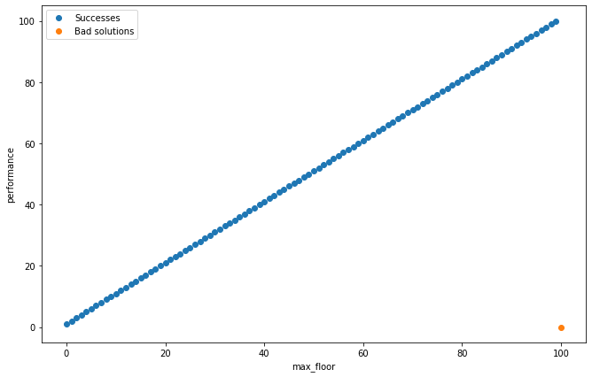

2. egg-drop challenge
---------------------

    we have a 100 story building and 2 eggs. we want to check what is
    the highest floor from where we can throw out an egg and it doesn't
    break. we want to find this out for sure by attempting the least
    amount of throws possible

a solution is a function where

parameters:

-  a function
-  it takes an integer parameter of the floor number and returns a
   boolean value of whether the egg breaks or not

returns:

-  an integer, the number of the highest floor where the egg doesn't
   break

it throws the egg the least amount of times possible, after it breaks
the second egg, it does not throw anymore

.. code:: ipython3

    from jkg_evaluators import eggdrop_100floor_2egg

.. code:: ipython3

    def my_solution1(breaks):
        
        for i in range(1,101):
            if breaks(i):
                return i - 1

.. code:: ipython3

    eggdrop_100floor_2egg.evaluate(my_solution1)

.. parsed-literal::

    - success rate: 100/101 (99.0%)
    - error count: 0
    - best performance: 1
    - worst performance: 100
    - mean performance: 50.99009900990099
    
    
     BAD SOLUTION at: 
     {'egg_count': 2, 'floor_count': 100, 'max_floor': 100}

.. code:: ipython3

    eggdrop_100floor_2egg.visualize(my_solution1)

